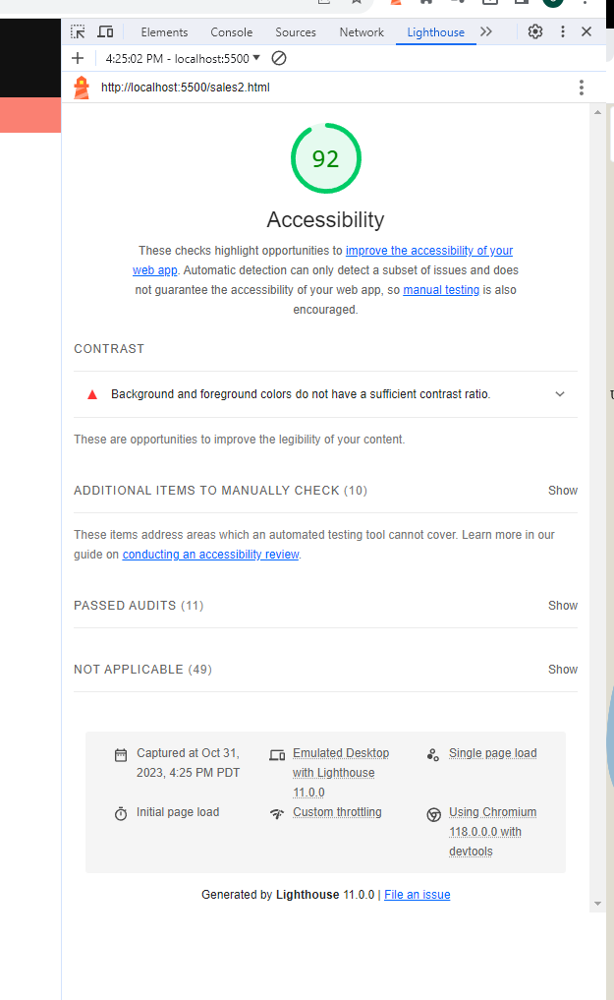

# LAB - 7

## Cookie-Stand

This is the cookie-stand project, second day. Added table to sales data, refactored js files.

### Author: Christopher Acosta

### Links and Resources

### Lighthouse Accessibility Report Score

* Lighthouse score for Lab 7!

  

### Reflections and Comments

#### Reading Journal entry:

* The lab was difficult. Adding tables is hard, rendering them correctly is harder. I managed to get the functions working following John's in class templates. The function to get the hourly totals for all locations was confusing. A TA helped me with that. I still need to include the overal total cell in the table. The home page still needs work. I remade my whole sales.html and sales.js and got rid of the old ones to reduce clutter.

#### Notes

* Still need a way to add last cell to table

* Still need work on my home page

* Still need to tweek some CSS
