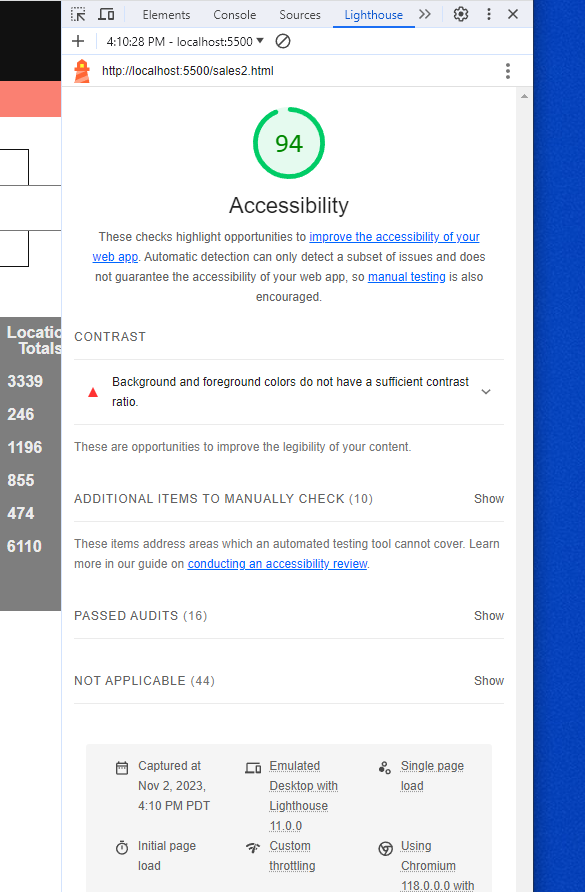

# LAB - 9

## Cookie-Stand

This is the cookie-stand project, fourth day. Added forms to sales data page with functionality to add a store with the inputs. Fixed a little CSS on home page.

### Author: Christopher Acosta

### Links and Resources

### Lighthouse Accessibility Report Score

* Lighthouse score for Lab 9!

  

### Reflections and Comments

#### Reading Journal entry:

* I was stuck on rendering the new store from form inputs for a while. It was a small mistake in my code...I had my brother come look at it and he pointed out the mistake in less than a minute. Just goes to show that having another pair of eyes to look at your code helps tremendously. I also fixed a bit of the CSS on the home page. I still don't like CSS, but I'm getting better.

#### Notes

* CSS is still a drag

* Have someone look at your code if your stuck!!! The error could be something small you're overlooking. In my case, my function to get random numbers was returning something but I wasn't using it for anything until further in the code. Quick fix.

