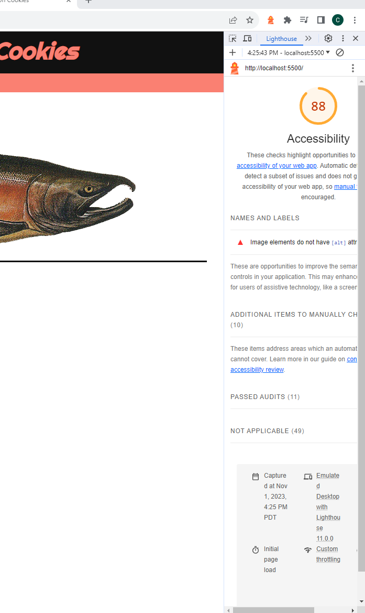

# LAB - 7

## Cookie-Stand

This is the cookie-stand project, third day. Finished sales data table, added more css to home page, added stores info to home page. Refactored code.

### Author: Christopher Acosta

### Links and Resources

### Lighthouse Accessibility Report Score

* Lighthouse score for Lab 8!

  

### Reflections and Comments

#### Reading Journal entry:

* Today was a lot better. Most of the work was already done. My brother helped me with the last cell in the table, the totals one with the reduce() method to add up the array. I added more css to the home page and added all store infos. I refactored my code a bit to make it cleaner.

#### Notes

* There are many ways to accomplish the same task in code. Learn from fellow classmates.
