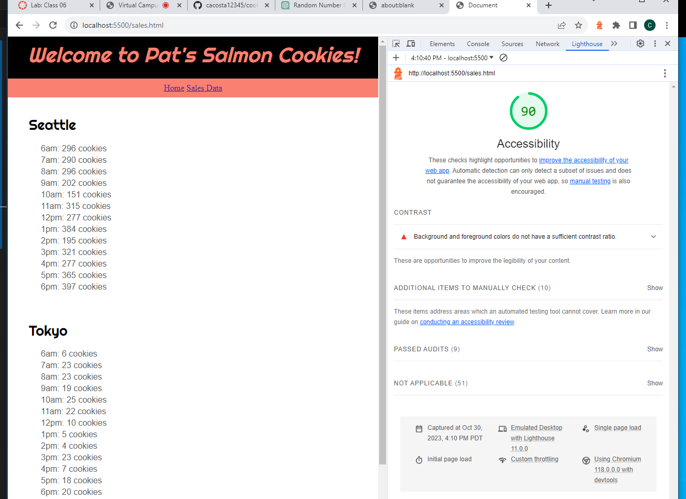

# LAB - 6

## Cookie-Stand

This is the cookie-stand project, first day. Added the city objects, rendered sales data for each city using given data and math.random method.

### Author: Christopher Acosta

### Links and Resources

### Lighthouse Accessibility Report Score

* Lighthouse score for Lab 6!

  

### Reflections and Comments

#### Reading Journal entry:

* The lab was kind of difficult. I had to do some research on how to generate the sales data and render it onto the dom. ChatGPT helped me with the function to get the random data, and my brother helped with come up with the for loop to get that data and append it to my cards as list items. It took about 4-5 hours to complete this part.

#### Notes

* Trying to find a way to write a function where I could input any city and populate the stats on the dom. I tried with a testCity but it didn't work so I commented the function out on my js file.

* After lots of trial and error, and with help from chatGPT, I got the populate cityStats function to work! As long as I have a card in the html file with a specific id ("city"Card).
